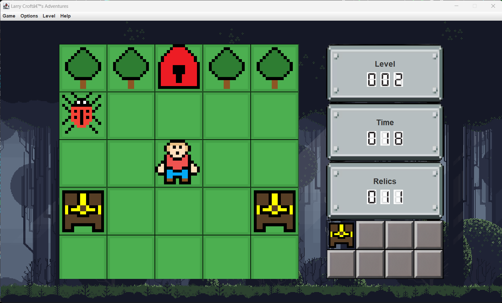

# SWEN225_FinalProject

## CHIP'S CHALLENGE Clone GAME Team 8

Start the game by running nz.ac.wgtn.swen225.lc.app.Main

The game has 2 levels. 

Level 1 simple with only 2 treasures and 1 key to collect.

Level 2 is with 5 actors/enemy and 12 items to collect.

The game has green tiles as background and trees as wall. 

There is also sound in game,it might be loud depending on the volume of testing machine.

Preferably run on IntelliJ/Eclipse.

Spotbugs:

* There are false positives for Scariest when Tile instances are compared to their subtypes and also for Persistency when the instanceof  Java syntax is used. This is invalid as we should be able to compare Subtype instances to super Types to confirm the subType is of the right subType. This is likely caused by new Java features detected by Spotbugs as ERRORS/Problems such as 
- instance object declarations all over the code -> for eg. if(Type instanceof SubType Obj) the Obj declaration inside the if statement is picked up as a bug...

* There are two things pulled up by spot bugs for Fuzz, they are both Troubling(14), High Confidence. They state that the two randomized variables are only used once. This is not true as they are randomized each time it loops through the for loop.

* The other bugs are all detected inside the JSON plugins and not in our code or implementations.

IMPORTANT:
Recorder Violates package/module dependency as they have implemented packages from Domain which they shouldn't have and this shows up in UML.
It also causes Errors in the game when replay functionality is used as its not finished or working properly.

## Game Display

